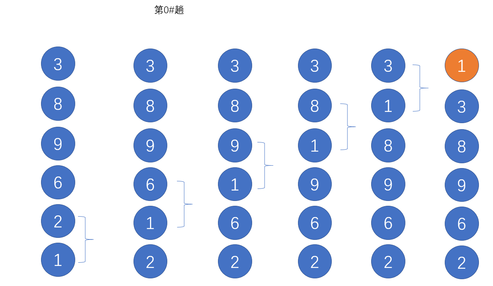
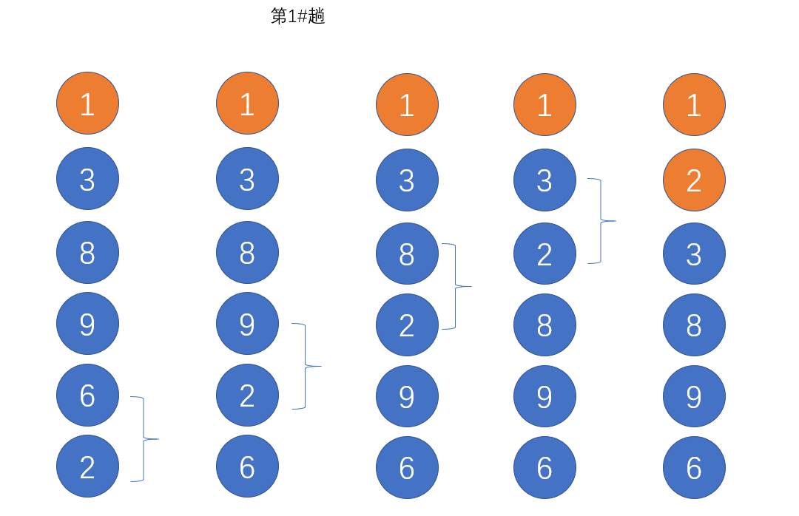
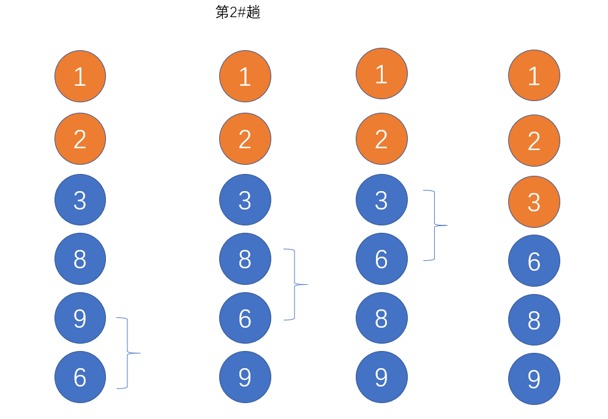
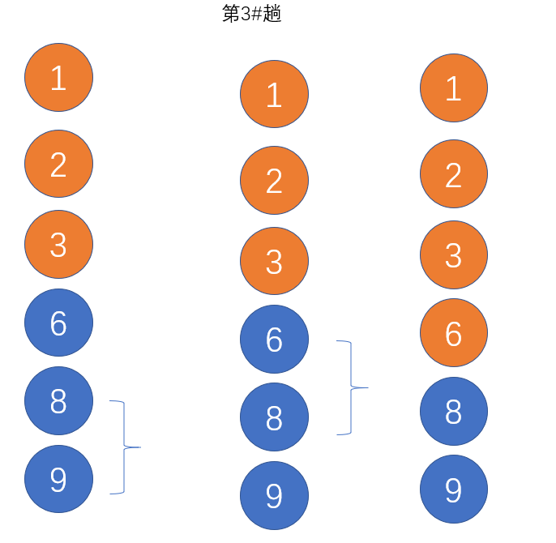
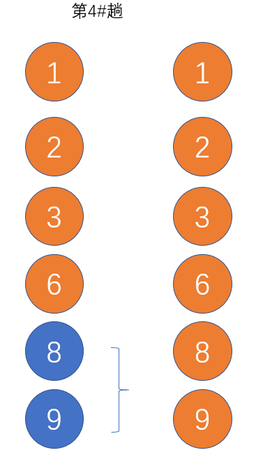

# javaSript基础题目

## javascript基础知识

* JavaScript是**弱类型**的编程语言，也可以叫**做动态类型**

* 请简述什么是变量声明提升？

  ​	**JS在执行之前有一个“预解析”阶段，相当于预习阶段，这个阶段JS会通读代码，得到所有的var语句，	进行预习。所以如果先输出变量a，然后再定义a变量，此时不会报错，而是会输出undefined。**

*  JavaScript有哪几种基本数据类型？它们用typeof检测结果分别是什么？

  * **number → number**

  * **string → string**

  * **boolean → boolean**

  * **undefined → undefined**

  * **null → object**
  * symbol

* 引用类型有哪些？
  * 数组
  * 对象
  * 函数
  * 正则表达式
  * ......

* 幂和开根号

  ```javascript
  Math.pow(2, 3) // 8   2的3次方
  Math.pow(3, 2) // 9   3的2次方
  Math.sqrt(81) // 9    81开根号
  Math.sqrt(-81) // NaN  -81开根号
  ```

* 向上取整与向下取整

  ```javascript
  Math.ceil() // 向上取整
  Math.floor() // 向下取整
  ```

*  四舍五入

  ```javascript
  Math.round(1.0)//1
  Math.round(1.4)//1
  Math.round(1.5)//2
  Math.round(1.6)//2
  Math.round(-1.0)//-1
  Math.round(-1.4)//-1
  Math.round(-1.5)//-1
  Math.round(-1.6)//-2
  ```

  **注意Math.round(-1.5)，也就是-1.5“四舍五入”的结果并不是-2，而是-1。这是为什么呢？**

  * 实际上，Math.round()方法准确说是**四舍六入**，5要进行判断对待。
    **Math.round()的原理是对传入的参数+0.5之后，再向下取整得到的数就是返回的结果，返回值为long型。这里的向下取整是说取比它小的第一个整数或者和它相等的整数。**

  ​     

* parseInt()函数: 功能是将数字或者字符串变为整数,尾部文字净化功能

  ```javascript
  parseInt(3.4) // 3
  parseInt(3.9) // 3
  parseInt(3) // 3
  parseInt(-3.4) // -3
  parseInt(-3.9) // -3
  parseInt(-3) // -3
  parseInt('3.9') // 3
  parseInt('3.4') // 3
  parseInt('-3.9') // -3
  parseInt('-3.4') // -3
  parseInt('365天') // 365
  parseInt('365个人') // 365
  parseInt('365.66天') // 365
  parseInt('3e5') // 3
  parseInt('a123') // NaN
  parseInt('abc') // NaN
  parseInt('') // NaN
  parseInt(undefined) // NaN
  parseInt(null) // NaN
  parseInt(Infinity) // NaN
  parseInt(NaN) // NaN
  
  parseInt('1111', 2) // 15
  
  parseInt('f', 16) // 15
  
  parseInt('17', 8) // 15
  ```

  

* parseFloat()函数: 功能是将字符串变为小数，同样的，它也有尾部文字净化功能

  ```javascript
  parseFloat('3.2') // 3.2
  parseFloat('3.9') // 3.9
  parseFloat('3') // 3
  parseFloat('3.8年') // 3.8
  parseFloat('3.8.9') // 3.8
  parseFloat('a3') // NaN
  parseFloat('') // NaN
  parseFloat(undefined) // NaN
  parseFloat(null) // NaN
  parseFloat(Infinity) // Infinity
  parseFloat(NaN) // NaN
  ```

  

* Number()函数实现数据类型转换

  ```javascript
  Number('123'); // 123
  Number('123.4'); // 123.4
  Number('123年'); // NaN
  Number('2e3'); // 2000
  Number(''); // 0
  Number('NaN'); // NaN
  Number(true); // 1
  Number(false); // 0
  Number(undefined); // NaN
  Number(null); // 0
  ```

* 隐式转换

  **加号两边如果有字符串，那么此时就会被当做连字符，其他数学运算需要使用Number()函数来强制类型转换.**

  ```javascript
  true * 6 // 6
  false * 6 // 0 3 * '2天' // NaN
  3 * '2e3' // 6000
  undefined * 4 // NaN  
  null * 4 // 0
  true + true // 2 5 + true // 6
  '5' + true // 5true
  '5' + undefined // 5undefined  
  ```

  


* 请总结NaN的特性:
  * **NaN是not a number表示不是一个数，但是typeof值是number，说明是一个数字类型值。**
  * **NaN会出现在所有数学计算，或者数学表达式中，如果结果实在得不到数字，结果就是NaN，比如3*’西瓜’结果就是NaN。**
  * **0/0的结果是NaN。**
  * **NaN不自等，NaN==NaN结果是false，所以JS内置了一个isNan()函数，用来检测某个东西是不是NaN，它的执行机理，就是Number（）转的东西如果是NaN，isNaN()结果就是true。**


* 请总结Number()函数将字符串、布尔、字符串、undefined、null转为数字的规律:

  * **【字符串转数字】纯数字字符串能够转为数字，空字符串会被转为0；其他不纯字符串将转为NaN。**

    ```javascript
    Number('2.3') // 2.3
    Number('2e3') // 2000
    Number('123') // 123
    Number('0xf') // 15
    Number('') // 0
    Number('23年') // NaN
    Number('true') // NaN
    ```

  * **【布尔值转数字】true就是1，false就是0**

  * **【null转数字】0**

  * **【undefined转数字】NaN**

## 字符串的方法与属性

​		

* length:字符串的length属性表示字符串的长度

* charAt() 得到指定位置字符，位置序号从0开始

* 可以直接书写`[]`得到某位字符，和数组非常类似

* substring() 提取子串

* substr() 提取子串

* slice() 提取子串

* toUpperCase() 将字符串变为大写

* toLowerCase() 将字符串变为小写

* indexOf() 检索字符串

  * indexOf()方法返回某个指定的字符串值在字符串中首次出现的位置

  * 如果要检索的字符串值没有出现，则该返回-1
  * indexOf()方法还可以接收第二个参数，表示从第几位开始寻找

* split()将字符串转换为数组

  * 不传参数：将整个字符串转为一个数组
  * 传`''`将每一个字符串以逗号每个为数组
  * 传参数，以当前字符进行分隔数组

  

```javascript
'我喜欢JS'.length; // 5

'我喜欢JS，我也喜欢HTML'.charAt(0); // '我' 
'我喜欢JS，我也喜欢HTML'.charAt(11); // 'T'
'我喜欢JS，我也喜欢HTML'.charAt(74); // ''

'我喜欢JS，我也喜欢HTML'[0] // '我' 
'我喜欢JS，我也喜欢HTML'[11] // 'T'
'我喜欢JS，我也喜欢HTML'[74] // ''

'I love you'.toUpperCase(); // 'I LOVE YOU'

'ABcdEfg'.toLowerCase(); // 'abcdefg'

'abcdeb'.indexOf('b'); // 1
'abcdeb'.indexOf('de'); // 3
'abcdeb'.indexOf('m'); // -1
'abcdeb'.indexOf('b', 2); // 5

'1234567'.split(); // ['1234567']
'1234567'.split('') // ['1', '2', '3', '4', '5', '6', '7']
'1231231234123'.split('2') //  ['1', '31', '31', '341', '3']
'1231231234123'.split(2) //  ['1', '31', '31', '341', '3'] 最好类型匹配，字符串为数字可以这样写

```


* 请说出substring、substr和slice的区别:

  答：**substring和slice参数都是(a下标，b下标)，从a开始到b下标结束，但是不包括b这个位置，下标从0开始数。区别是两个：**

  **第一个是substring可以自动的交换两个参数的位置，保证小数在前面，大数在后面**

  **第二个是slice可以是负数**

  **substr参数是（a小标，长度），参数可以是负数**

  ```javascript
  console.log('ABCDEFG'.slice(2, 4));//CD  从下标2开始，到下标四，不包含下标4
  console.log('ABCDEFG'.substr(2, 4));//CDEF 从下标2开始，连续截取四个
  console.log('ABCDEFG'.substring(2, 4));//CD 从下标2开始，到下标四，不包含下标4
  console.log('ABCDEFG'.substring(4, 2));//CD 从下标2开始，到下标四，不包含下标4
  console.log('ABCDEFG'.substr(-4, 2));//DE 从下表-4开始截取长度为2的项
  console.log('ABCDEFG'.substr(4));//EFG
  console.log('ABCDEFG'.slice(4));//EFG
  ```

  * **slice方法和substring是一伙的，都是坐标,坐标。区别：**

    **① slice支持负数**

    **② substring可以自动交换大小数**

    **substr是特殊的，是坐标, 长度。**

  

  

* 请总结String()函数将数字、布尔、字符串、undefined、null转为数字的规律：
  * **所有东西用String()转为字符串，都是长成一个样子的字符串。**
  
  

* 请总结Boolean()函数将字符串、数字、字符串、undefined、null转为数字的规律
  * 【数字转布尔】，0和NaN就是false，非0就是true
  * 【字符串转布尔】空字符串是false，非空字符串就是true
  * 【undefined和null都是false】

## 函数

* 函数的提升

  * 和变量声明提升类似，函数声明也可以被提升

  * 这意味着，即使先调用函数，然后再定义函数，函数也能执行，不会报错 

    

  ```javascript
  //整个函数在预解析阶段被提升
  fun();
  function fun() {
  console.log('A');
  }
  ```

  * 如果函数是用函数表达式的写法定义的，则没有提升特性

  ```javascript
  
  fun(); // 引发错误
  //只提升定义，不提升值，相当于这里在试图执行undefined
  var fun = function () {
  alert("函数被执行");
  }
  ```

  * 当函数名与变量名相同时，函数先提升

  ```javascript
  fun(); // B
  var fun = function () {// 后提升
  console.log('A');
  }
  function fun() {// 先提升
  console.log('B');
  }
  fun(); // A
  
  ```

  

* 变量声明提升无视if语句

  ```javascript
  var a = false;
  function fun() { 
      a = 10; // 局部变量
  	if (a) {
  	var a = 20; // 程序预读取阶段，无论if语句是否为真，var a都能提升！
  	}
   }
  fun();
  console.log(a); // false
  ```

* 形参没有被传值，也能够遮蔽全局变量

  ```javascript
  var m = 10;
  var n = 20;
  function fun(m, n) {
    console.log(n); //undefined
    m += n;
    console.log(m); // NaN
  }
  fun(30);
  console.log(m); // 10
  ```

* 使用变量时，JS会从当前层开始，逐层向上寻找定义

  ```javascript
  var a = 10;
  var b = 20;
  function fun() {
  	var c = 30;
  	function inner() {
  		var a = 40;
  		var d = 50;
  		console.log(a, b, c, d); // 40 20 30 50
  	}
  	inner();
  }
  fun();
  ```

### 闭包

1. 嵌套作用域环境下
2. 内层函数引用外层函数变量
3. 内层函数被返回到其他作用域

### 闭包用途

* 当闭包产生时，**函数所处环境的状态会始终保持在内存中，不会在外层函数调用后被自动清除**。这就是闭包的记忆性。
* 模拟私有变量。

```javascript
function addCount() {
var count = 0;
return function () {
	count = count + 1;
	console.log(count);
	};
}
var fun1 = addCount();
var fun2 = addCount();
fun1();	// 1
fun2();	// 1
fun2();	// 2
fun1();	// 2
```

### 闭包的缺点

* 不能滥用闭包，否则会**造成网页的性能问题**，严重时可能**导致内存泄露**。
  * 所谓内存泄漏是指程序中己动态分配的内存由于某种原因未释放或无法释放。 

## 数组

* push（尾增）

  * 向数组的尾部增加1个或者多个成员，返回值是数组的长度，会改变原数组。

  ```javascript
  var arr=[1,2,3,4,5,6]
  arr.push(7,8)
  console.log(arr) // [1,2,3,4,5,6,7,8]
  ```

  

* pop（尾删）

  * 不需要参数，默认从数组的尾部移除一项，返回值是删除的项，会改变原数组。

  ```javascript
  var arr = [1, 2, 3, 4, 5, 6];
  arr.pop();
  console.log(arr); // [1,2,3,4,5]
  ```

  

* unshift（头增）

  * 向数组的头部增加1个或者多个成员，返回值是数组的长度，会改变原数组。

  ```javascript
  var arr = [1, 2, 3, 4, 5, 6];
  arr.unshift(7);
  console.log(arr); // [7,1,2,3,4,5,6]
  ```

  

* shift（头删）

  * 不需要参数，默认从数组的头部移除一项，返回值是删除的项，会改变原数组。

  ```javascript
  var arr = [1, 2, 3, 4, 5, 6];
  arr.shift();
  console.log(arr);// [ 2, 3, 4, 5, 6 ]
  ```

  

* concat(合并)

  *  不会改变原数组 

  ```javascript
  var arr = [1, 2, 3, 4, 5, 6];
  var arr1 = arr.concat("我", "是", "字符");
  var arr2 = arr.concat(["我", "是", "数组"]);
  var arr3 = arr.concat({ a: "我", b: "是", c: "对象" });
  console.log(arr); // [ 1, 2, 3, 4, 5, 6 ]
  console.log(arr1); //[ 1, 2, 3, 4, 5, 6,'我', '是', '字符']
  console.log(arr2); //[ 1, 2, 3, 4, 5, 6,'我', '是', '数组']
  console.log(arr3); //[ 1, 2, 3, 4, 5, 6,{ a: '我', b: '是', c: '对象' }]
  ```

  * **该方法字符串也可以使用**

* slice(截取）

  * 不会改变原数组
  * 表示左闭右开，包含了左边下标为的成员，不包含了右边下标为的成员

  ```javascript
  var arr = [1, 2, 3, 4, 5, 6];
  var arr1 = arr.slice(2);
  var arr2 = arr.slice(2, 4); // 包含下表2，不包含下表4
  console.log(arr1); // [ 3, 4, 5, 6 ]
  console.log(arr2); // [ 3, 4 ]
  ```

  * **该方法字符串也可以使用**

    

* splice(增加、删除、替换)

  * 会改变原数组

  ```javascript
  var arr = [1, 2, 3, 4, 5, 6];
  arr.splice(2); // 从下标2开始删除后面所有
  console.log(arr); // [ 1, 2 ]
  
  var arr1 = [1, 2, 3, 4, 5, 6];
  arr1.splice(2, 2); // 从下标2开始连续删除2项
  console.log(arr1); // [ 1, 2, 5, 6 ]
  
  var arr2 = [1, 2, 3, 4, 5, 6];
  arr2.splice(2, 2, "用来替换", "删除的两项");
  console.log(arr2); //[ 1, 2, '用来替换', '删除的两项', 5, 6 ]
  
  var arr3 = [1, 2, 3, 4, 5, 6];
  arr3.splice(2, 2, ["用来替换", "删除的两项"]);
  console.log(arr3); //[ 1, 2, [ '用来替换', '删除的两项' ], 5, 6 ]
  
  var arr4 = [1, 2, 3, 4, 5, 6];
  arr4.splice(2, 0, "新增一项");
  console.log(arr4); //[ 1, 2, '新增一项', 3, 4, 5, 6 ]
  ```

  

  

  

* sort 排序 会改变原数组

  ```javascript
  var arr = [3, 6, 2, 4, 7, 0, 5];
  arr.sort(function (a, b) {
    return a - b; //从小到大
    //   return b - a; //从大到小
  });
  console.log(arr); // [0, 2, 3, 4,5, 6, 7]
  ```

  

* reverse 逆序 会改变原数组

  ```javascript
  var arr = [1, 2, 3, 4, 5, 6];
  arr.reverse();
  console.log(arr); // [ 6, 5, 4, 3, 2, 1 ]
  ```

  

  

* indexOf 查找

  ```javascript
  var arr = [1, 2, 3, 4, 5, 6];
  var a = arr.indexOf(1); //这一项存在 返回这一项的下标
  var b = arr.indexOf(9); //这一项不存在 返回-1
  console.log(a); //0
  console.log(b); // -1
  ```

  **该方法字符串也可以使用**

* join 转为字符串

  ```javascript
  var arr = [1, 2, 3, 4, 5, 6];
  var str = arr.join();
  var str1 = arr.join(",");
  console.log(str); // 1,2,3,4,5,6
  console.log(str1); // 1,2,3,4,5,6
  ```

  

* toSring 转为字符串

  ```
  var arr = [1, 2, 3, 4, 5, 6];
  var str = arr.toString();
  console.log(str); // 1,2,3,4,5,6
  ```

  

* 

* Array.isArray( 参数) 检测这个参数是不是数组。

  ```
  console.log(Array.isArray([1, 2, 3, 4, 5, 6])); // true
  console.log(Array.isArray({ a: 1 })); // false
  console.log(Array.isArray("aaa")); // false
  ```

  

* arr.forEach() 

  * 不改变原数组，不会生成新数组

  ```javascript
  var arr = [1, 2, 3, 4, 5, 6];
  var arr1 = [];
  arr.forEach((item, index, arr) => {
    return item > 1 ? arr1.push(item) : "";
  });
  console.log(arr1); //[ 2, 3, 4, 5, 6 ]
  ```

  

  

* arr.map（）该方法是一个映射方法，会根据原数组生成一个新数组。

  * 一般用来修改数据（删filter改map）

  ```javascript
  var arr = [1, 2, 3, 4, 5, 6];
  // 一定要重新赋值，否则arr还是不变
  arr = arr.map((item, index, arr) => {
    return item == 1 ? (item = "我是修改的") : item;
  });
  console.log(arr); //[ '我是修改的', 2, 3, 4, 5, 6 ]
  ```

  

* arr.filter（）该方法是用于根据条件过滤数组，会根据原数组生成一个新数组。

  * 一般用来删除数据（删filter改map）

  ```javascript
  var arr = [1, 2, 3, 4, 5, 6];
  // 一定要重新赋值，否则arr还是不变
  arr = arr.filter((item, index, arr) => {
    return item % 2 == 0 ? item : "";
  });
  console.log(arr); //[ 2, 4, 6 ]
  ```

  

* arr.some（）断言,用于检测数组中的元素是否满足指定条件。不会改变原始数组

  * some() 方法会依次执行数组的每个元素：
    * 如果有一个元素满足条件，则表达式返回*true* , 剩余的元素不会再执行检测。
    * 如果没有满足条件的元素，则返回false。

  ```javascript
  var arr = [1, 2, 3, 4, 5, 6];
  var isHas = arr.some((item, index, arr) => {
    return item % 2 == 0 ? item : "";
  });
  console.log(isHas); // true
  ```

  

  **注意： some() 不会对空数组进行检测。**

  

* arr.every（）断言。用于检测数组所有元素是否都符合指定条件,不会改变原始数组

  * 如果数组中检测到有一个元素不满足，则整个表达式返回 *false* ，且剩余的元素不会再进行检测。
  * 如果所有元素都满足条件，则返回 true。

  ```javascript
  var arr = [1, 2, 3, 4, 5, 6];
  var isHas = arr.every((item, index, arr) => {
    return item % 2 == 0 ? item : "";
  });
  console.log(isHas); // false
  ```

  **注意： some() 不会对空数组进行检测。**

* arr.fill（）填充方法。

  * 将一个固定值替换数组的元素

  ```javascript
  var arr = [1, 2, 3, 4, 5, 6];
  arr.fill("我是填充的值", 2, 4); // 从下标2开始填充到下标4，不包括下标四
  console.log(arr); //[ 1, 2, '我是填充的值', '我是填充的值', 5, 6 ]
  ```

  * 如果不写开头下表，标是从下标0开始；不写结尾下标，默认是当前数组长度

* `arr.reduce( (total, currentValue, currentIndex, arr)=>{}, initialValue)`循环方法。

  * 接收一个函数作为累加器，数组中的每个值（从左到右）开始缩减，最终计算为一个值。
  * reduce()可做为高阶函数，用于函数的，compose
  * reduce()无法调用空数组，会报错。
  * **注意的是当不写 第二个参数initialValue时，也就是没有初始值时，函数第一次累加的 total 将会是 arr 的第一个元素，currentindex 的值为 1；当写了第二个参数initialValue（不管你这个值写什么），currentindex 从0开始**

  ```javascript
  var arr = [1, 2, 3, 4, 5, 6];
  var allsum = arr.reduce((sum, currentValue, currentIndex, arr) => {
    return (sum += currentValue);
  }, 0);
  console.log(allsum); //21
  ```

  

  

* arr.reduceRight（）和reduce()相似。
  区别：reduce是从左向右循环，本方法是从右向左循环

  ```
  var arr = [1, 2, 3, 4, 5, 6];
  var allsum = arr.reduceRight((sum, currentValue, currentIndex, arr) => {
    return (sum += currentValue);
  });
  console.log(allsum); //21
  ```

  

##  对象
* [对象基础](./笔记/01_对象.md)
* [对象的深浅克隆](./笔记/02_对象的深浅克隆.md)
* [对象上下文](./笔记/03_上下文.md)
* [call与apply指定函数上下文](./笔记/04_call与apply指定函数上下文.md)
* [new调用函数四步走](./笔记/05_new调用函数四步走.md)
* [构造函数](./笔记/06_构造函数.md)
* [类与实例](./笔记/07_类与实例.md)
* [prototype和原型链](./笔记/08_prototype和原型链.md)
* [包装类](./笔记/09_包装类.md)
* [Math对象](./笔记/10_Math对象.md)
* [Date日期对象](./笔记/11_Date日期对象.md)
* [闭包](./笔记/闭包.md)

### 案例

[红绿灯案例](./案例/01_红绿灯案例.html)
[炫彩小球](案例/02_炫彩小球.html)
[倒计时程序](案例/03_倒计时程序.html)
[对象的深克隆](案例/02_对象的深克隆.html)

## 题目

1. 下面4个表达式中的结果为？

   ```javascript
   100 / 0; //非零数字除以0，结果是Infinity
   
    0 / 0;	//0除以0，结果是NaN
   
   parseInt("爱前端"); //parseInt()如果转一个不是以数字开头的字符串，那么结果就是NaN。比如parseInt(‘我123’)结果就是NaN，但是parseInt(‘123我’)结果就是123
   
   "大漠孤烟直" - "长河落日圆";// 减法运算，如果参与的是字符串，就是NaN。
   ```

2. 下面5个表达式中，结果为？

  

  ```javascript
  Number('123年');	// NaN，Number转换不纯数字字符串的时候，结果一定是NaN 
  
  parseInt('123年'); // 123，因为parseInt有尾部净化功能
  
  Number('');	// 0
  
  parseInt(''); // NaN
  
  NaN == NaN;  // NaN不自等，正是因为NaN不自等，所以才有isNaN()这个函数。isNaN()函数的机理是如果这个东西用Number()函数转为的结果是NaN，那么isNaN()的结果就是true
  
  isNaN("365天"); // true 
  
  NaN == undefined;  // NaN不自等， 它怎么等于别人。
  
  null == undefined; // true 
  
  undefined == 0;  // undefined只和自己等和null等，它和其他一切的值都不==。undefined进行任何数学运算都等于NaN
  
  null == '';	// false，null不等于0，不等于任何字符串,但是进行数学运算会转成0，也就是Number(null)结果就是0，人家就是这么规定的；
  
  null == null; 	// true
  
  0.1 + 0.2 == 0.3; // false，因为IEEE754,会使一些个别的小数运算产生“丢失精度”问题
  
  3 – Infinity; //– Infinity
  Infinity - Infinity; // NaN
  ```

3. 下面程序的执行结果为？

  ```javascript
  var a = 3;
  var b = 4;
  var c = a++ + b++ + ++a + ++b; // a++是先用再加，++a是先加再用，从左往右看，所以是3+4+5+6
  console.log(c); // 18
  ```

4. 下面程序的执行结果为？

  ```javascript
  var a = 5 && true;  // true
  var b = false || 6;  // 6
  var c = true + true; // 2
  console.log(a + b + c); // 9
  ```


  


5. 下面程序的执行结果为？

  ```javascript
  console.log(foo); // undefined,变量声明提升，但是未赋值
  var foo = 1; 
  var foo = 10;
  ```

  

  

6. 程序运行结果是？

   ```javascript
   var a = "3.2";
   var b = 0.8;
   var c = parseInt(a + b);//'3.20.8'
   console.log(c);// 3
   ```

   

7. 下面程序运行结果是？

   ```javascript
           if (1) {
               console.log('A'); //A
           }
           if (1 == true) {//一个数是数字：将其他的转换为数字比较
               console.log('B'); //B
           }
           if ('abc') {
               console.log('C'); //C
           }
           if ('abc' == true) {//如果一个是boolean,全部转换为数字比较
               console.log('D');
           }
           if (Infinity) {
               console.log('E'); //E
           }
           if (Infinity == true) {//一个数是数字：将其他的转换为数字比较
               console.log('F');
           }
   		//输出结果是  A B C E
   ```

   **一个数是数字：将其他的转换为数字比较**

   **如果一个是boolean,全部转换为数字比较**

   **如果一个是对象，将对象转换为另一个对应的（boolean,数字转换为数字），字符串就将对象转换为字符串**

   

8. 程序运行结果：

   ```javascript
   var t = 0;
   do {
       t++; // 1
   } while (t * t >= 20000) // 1*1不满足大于等于20000的，所以不再仅需执行了。输出1
   console.log(t); // 1
   ```

   

9. 请手动模拟下面的数组[3, 8, 9, 6, 2, 1]**冒泡排序**的整个过程

   

   

   

   

   

   

   ```javascript
           var arr = [3, 8, 9, 6, 2, 1];
           //外层循环表示排序的次数
           for (var i = 0; i < arr.length - 1; i++) {
               //内层循环表示每次比较的数据
               for (var j = 0; j < arr.length - i - 1; j++) {
                   if (arr[j] > arr[j + 1]) {
                       var temp = arr[j + 1];
                       arr[j + 1] = arr[j];
                       arr[j] = temp;
                   }
               }
           }
           console.log(arr); //[1, 2, 3, 6, 8, 9]
   
   ```

   

   

10. 数组扁平化  

    ```javascript
            var arr1 = [1, 2, [3, 4, [5, 6, [7, 8], 9], 10], 11];
    
            var result = [];
    
            // 这个函数的参数一定是一个数组
            function flatten(arr) {
                for (var i = 0; i < arr.length; i++) {
                    if (Array.isArray(arr[i])) {
                        flatten(arr[i]);
                    } else {
                        // 不用递归
                        result.push(arr[i]);
                    }
                }
            }
    
            flatten(arr1);
            console.log(result); // [1, 2, 3, 4, 5, 6, 7, 8, 9, 10, 11]
    ```

    

    

11. 数组浅克隆

    ```javascript
            var arr1 = [1, 2, 3, 4, [5, 6]];
    
            // 创建一个结果数组
            var arr2 = [];
    
            // 遍历原有数组，将每一项推入
            for (var i = 0; i < arr1.length; i++) {
                arr2.push(arr1[i]);
            }
    
            // 结果是false，是好事儿，因为内存分开了。
            console.log(arr1 == arr2);
    
            // 但是，尝试给子数组推入一个7，那么arr2也变化了，说明“藕断丝连”
            arr1[4].push(7);
            console.log(arr2); //[1, 2, 3, 4, [5, 6, 7]];
    ```

    

12. 数组深克隆

    ```javascript
            var arr1 = [1, 2, 3, 4, [5, 6]];
    
            // deepclone的参数不一定是数组，一会儿可能基本类型值进来
            function deepclone(item) {
                // 判断item是不是数组，注意数组要用Array.isArray()来判断，不能用typeof
                // typeof返回值是object，和对象雷同了
                if (Array.isArray(item)) {
                    // 如果是数组就进行一次浅克隆，但是每一项要再次进入到deepclone函数中
                    var result = [];
                    for (var i = 0; i < item.length; i++) {
                        result.push(deepclone(item[i]));
                    }
                    return result;
                } else {
                    // 如果是基本类型值，直接返回
                    return item;
                }
            }
    
            var arr2 = deepclone(arr1);
            console.log(arr2[4] == arr1[4]);
            console.log(arr2);
    ```


