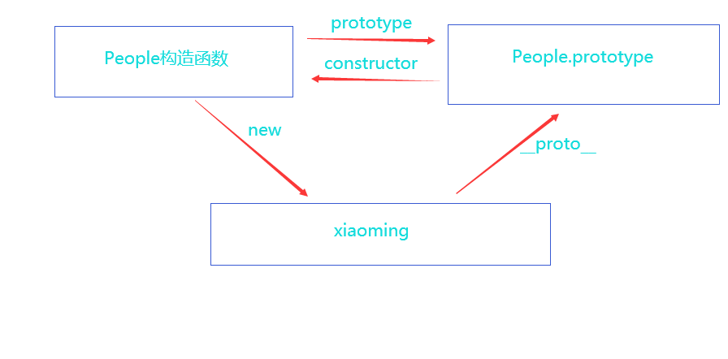
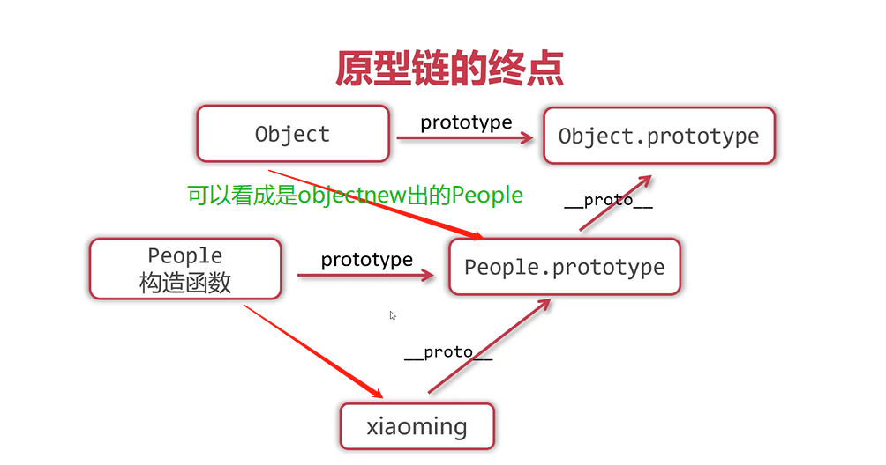
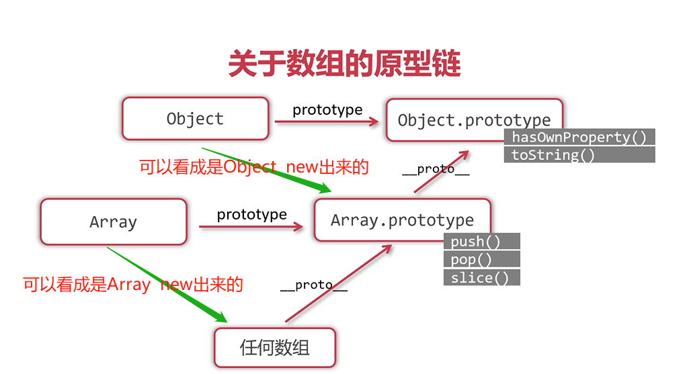
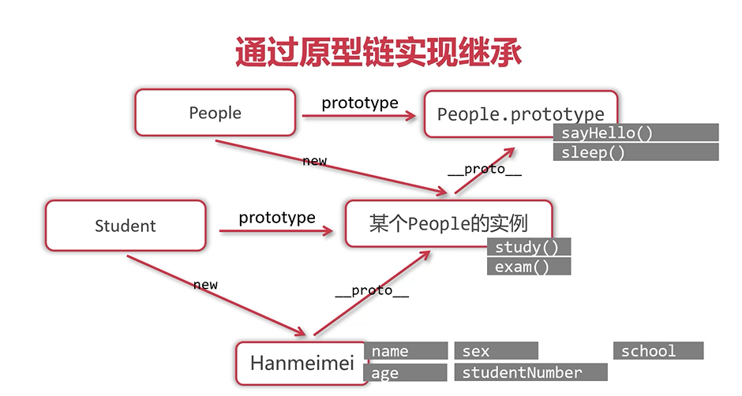

#  prototype和原型链

## 什么时prototype属性？

* 任何函数都有prototype属性，prototype是“原型”的意思
* prototype属性值是一个对象，它默认拥有**constructor属性，这个属性指向函数**

| 函数____prototype____--->函数.prototype（得到prototype对象） |
| ------------------------------------------------------------ |
| 函数<---____constructor____函数.prototype（这个对象天生具有constructor 属性指向函数） |

## prototype的作用

* 在普通函数中，prototype 属性没任何用处
* 在构造函数中prototype 属性非常有用

##  构造函数中prototype 属性

* **构造函数的prototype 属性是它实例的原型**,
  * 

```javascript
console.log(xiaoming.__proto__ === People.prototype);//true
```

## 原型链查找

* javaScript规定：**实例可以打点访问它原型的属性和方法**，这被称为“原型链查找”

* 原型链的遮蔽：

  * 首先这个实例会先看一下自己身上有没有这个属性，没有**才**到这个实例的原型上去找

  ```javascript
        function People(name, age, sex) {
          this.name = name;
          this.age = age;
          this.sex = sex;
          this.introduce = function () {
            console.log(`我是${this.name},今年${this.age},性别${this.sex}`);
          };
        }
        // 在构造函数的prototype上添加一个属性
        People.prototype.national = "中国";
        var xiaoming = new People("小明", 20, "男");
        //	实例直接打点调用添加的属性
        // 首先这个实例会先看一下自己身上有没有这个属性，没有就到这个实例的原型上去找
        console.log(xiaoming.national); //中国
  ```

##  hasOwnProperty

* hasOwnProperty方法可以检查对象是否真正“自己拥有”某个属性方法

  ```javascript
        function People(name, age, sex) {
          this.name = name;
          this.age = age;
          this.sex = sex;
          this.introduce = function () {
            console.log(`我是${this.name},今年${this.age},性别${this.sex}`);
          };
        }
        // 在构造函数的prototype上添加一个属性
        People.prototype.national = "中国";
        var xiaoming = new People("小明", 20, "男");
  	  //检查对象是否真正“自己拥有”某个属性方法
        console.log(xiaoming.hasOwnProperty("national"));//false
        console.log(xiaoming.hasOwnProperty("name")); //true
  ```

## in操作符

* in运算符**只能检查某个属性或方法是否可以被对象访问，不能检查是否是自己的属性或方法**

  ```javascript
        function People(name, age, sex) {
          this.name = name;
          this.age = age;
          this.sex = sex;
          this.introduce = function () {
            console.log(`我是${this.name},今年${this.age},性别${this.sex}`);
          };
        }
        // 在构造函数的prototype上添加一个属性
        People.prototype.national = "中国";
        var xiaoming = new People("小明", 20, "男");
  	  //检查某个属性或方法是否可以被对象访问
        console.log("national" in xiaoming); //true
        console.log("name" in xiaoming); //true
  ```

## 在prototype上添加方法

* 之前，我们把方法写道对象身上，每个实例与每个实例的方法函数都是内存中不同的函数，造成了内存浪费
  * 如下所示

*  ```javascript
  function People(name, age, sex) {
          this.name = name;
          this.age = age;
          this.sex = sex;
          this.introduce = function () {
            console.log(`我是${this.name},今年${this.age},性别${this.sex}`);
          };
        }
        var xiaohua = new People("小华", 15, "女");
        var xiaocao = new People("小草", 20, "女");
        // 函数是引用类型值，全等比较相同为true，不同为false
        console.log(xiaocao.introduce === xiaohua.introduce); //false
  ```

  * 解决方法：将方法写到prototype 上

## 原型链的终点



`Object.prototype`上有`hasOwnProperty()方法，toString()方法`所以小明这个实例通过原型链查找也能调用这些方法

## 关于数组的原型链



## 继承

* 实现继承的关键在于：**子类必须拥有父类的全部属性和方法**，同时子类还应该定义自己特有的属性和方法
* 使用javaScript特有的**原型链来实现继承**，是普遍的做法



```javascript
     function People(name, age, sex) {
        this.name = name;
        this.age = age;
        this.sex = sex;
      }
      People.prototype.sayhello = function () {
        console.log("我是" + this.name + "今年" + this.age);
      };
      function Student(name, age, sex, school, num) {
        this.name = name;
        this.age = age;
        this.sex = sex;
        this.school = school;
        this.num = num;
      }
      // 实现继承，学生类继承人类
      Student.prototype = new People();
      // 注意，重写的时候一定要在继承的语句下面写
      // 重写、复写父类sayhello方法，让学生特殊一点
      Student.prototype.sayhello = function () {
        console.log("您好！我是" + this.name + "今年" + this.age);
      };
      Student.prototype.study = function () {
        console.log(this.name + "正在学习");
      };
      Student.prototype.exam = function () {
        console.log(this.name + "正在考试");
      };
      var hanmeimei = new Student("韩梅梅", 17, "女", "中心小学", 10086);
      console.log(hanmeimei);
      hanmeimei.sayhello();
      var xiaoming = new People("小明", 18, "男");
      xiaoming.sayhello();
```

